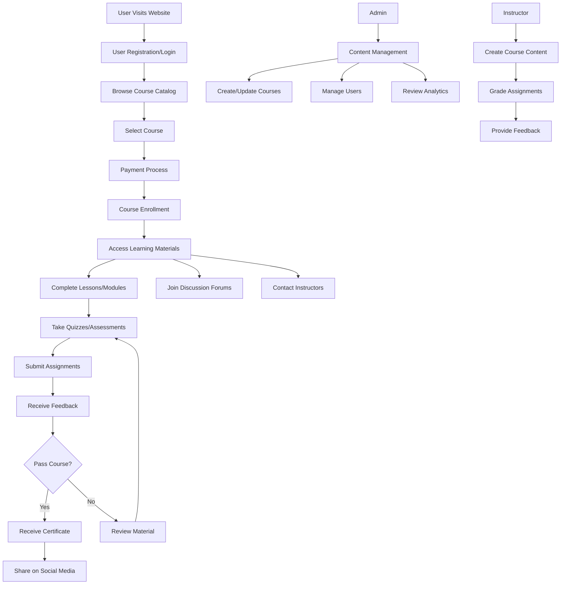
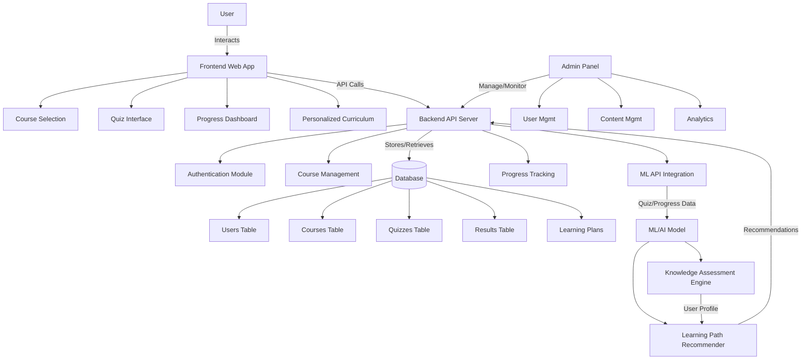
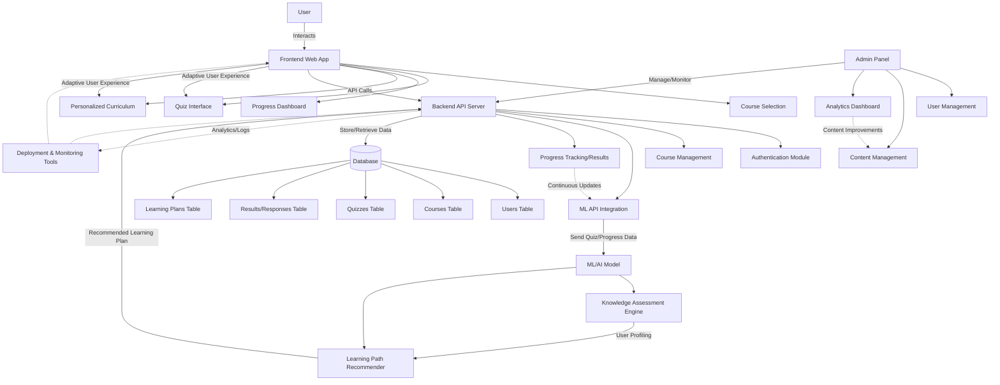

<!-- Project Banner -->


<h1 align="center">AI-Powered Adaptive Educational Platform</h1>
<p align="center">
  Unlock personalized learning with AI — Tailored courses, quizzes, and learning paths for every learner.
</p>

<p align="center">
  <a href="https://github.com/your-org/ai-edu-platform/issues">
    
  </a>
  <a href="https://github.com/your-org/ai-edu-platform/network/members">
    
  </a>
  <a href="https://github.com/your-org/ai-edu-platform/stargazers">
    
  </a>
  <a href="LICENSE.txt">
    
  </a>
</p>

---

## 📚 We Need Your Help 

**🤝 Contributing**
Fork the repository

Create a feature branch (git checkout -b feature-name)

Commit changes (git commit -m "Add new feature")

Push (git push origin feature-name)

Open a Pull Request

📌 Please follow coding standards, update docs, and join code reviews.
---

## 🚀 Features

- **Adaptive Learning** – Quizzes & projects adapt in real-time to users’ performance.
- **Personalized Curriculum** – AI-generated learning journeys tailored to each learner.
- **Progress Dashboard** – Track achievements & recommended next steps.
- **Admin Controls** – Secure course & user management, plus analytics.
- **Scalable Architecture** – Responsive frontend, robust backend, and modular ML.

---

## 📂 Directory Structure
```
KnownGrow-platform/
├── backend/ # Python API server, logic, database, and ML models
│ ├── api/
│ ├── core/
│ ├── database/
│ ├── ml/
│ └── main.py
├── frontend/ # React-based web interface
│ ├── public/
│ └── src/
├── docs/ # Documentation and architecture diagrams
├── docker/ # Deployment scripts and containerization
├── README.md
└── requirements.txt
```
---

## 🏗 Architecture





